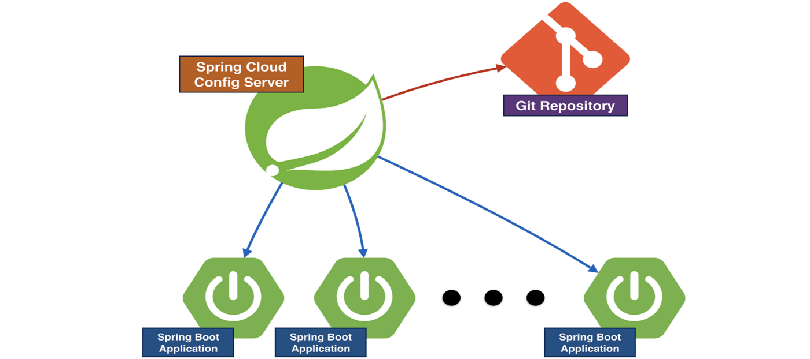

# Spring Cloud Properties Refresher

## Overview



This is a library to schedule calls with fix time rate to call the app actuator `refresh` endpoint. By calling the refersh endpoint, a call will be made to the [Spring config server](https://cloud.spring.io/spring-cloud-config/reference/html/) to refresh the app properties. Note there are other ways for the spring boot app to refresh its properties,  but this library offer the simplest way of achieving this.

## How to include this library in your SpringBoot app?

1. Add the dependency in your pom file

```xml
<dependency>
    <groupId>com.vfc.mkpl</groupId>
    <artifactId>mkpl-common-springcloud-config-refresher</artifactId>
    <version>1.0.4</version>
    <scope>runtime</scope>
</dependency>

```

2. Import the refresher component through Spring Annotation.

```
@SpringBootApplication
@EnableScheduling
@Import({RestConfig.class, PropertyRefresher.class})
public class Application {
    public static void main(String[] args) {
        SpringApplication.run(Application.class, args);
    }
}
```

3. Set the refresh rate of the properties in the application.yml
```
# in milliseconds
propertiesRefreshRate=90000000

```
